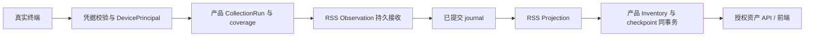

# 基于 RSS 的 Rust 产品重写

状态：工程方向确定，以下首期组合与拆分作为实施基线；具体接口、支持矩阵和生产参数随对应交付冻结。

目标 owner 为 [项目目标](../../product/project-goals.md)；源码复核见 [当前基线](../../reference/202609072231-003-rss-current-baseline.md)。

## 仓库与依赖边界

| 仓库 | 拥有 | 不拥有 |
| --- | --- | --- |
| RSS | 已接纳的公共契约、持久消息、命令、Observation、Projection、Reconcile、Saga、runtime 等组件及 provider | MDM 业务、设备认证、平台协议、产品配置与迁移执行 |
| rss-mdm | Device/Registration/Authority、CollectionRun、Inventory、Group/Criteria、EffectiveDevicePlan、Policy/Compliance、Artifact/Deployment、Access/Audit、原生会话与交付、服务端装配 | 第二套通用 Outbox/命令引擎、终端安装与更新实现 |
| rss-mdm-agent | Rust Agent 的本地 journal、采集、执行、结果恢复、Windows/macOS 适配、签名安装和更新 | 服务端策略权威、PG/broker adapter、另一份共享协议定义 |
| 现有前端仓 | 页面与交互；适配版本化管理 API | 产品状态与字段规则的独立实现 |

Agent wire schema/DTO 由 `rss-mdm` 中的独立协议包拥有，经版本化 artifact 向 Agent 发布；只含协议值类型与兼容约定，不传 Rust 内存对象，不引入服务端 domain、PG 或 RSS provider 闭包。两端可以使用不同 RSS 版本，线上协议兼容不等于 Cargo 版本相同。

通道中立的身份与报告模型先由产品定义；Agent 协议 producer PR 先产出版本化 artifact，Agent 公共 core/journal 的 consumer PR 锁定后，Windows 与 Mac 平台 adapter 才分别接入。Agent-only 与 Mac 原生注册均不依赖 Windows MDM 注册完成。

产品组合根 → 用例与产品/RSS adapter → 产品 domain / RSS capability core。domain 不依赖 HTTP/SQL/broker；RSS 不依赖产品。业务模块先按类型与可见性隔离，出现实际边界再建包，不预建所有领域 crate 或全局依赖容器。

## 首期运行结构

`api`、`gateway`、`worker`、`migrate` 是职责边界，后续可由一个 app package 提供多个 binary。migrate 为一次性进程；API 与设备入口按认证与网络边界配置。无需给 Group、Policy、Resource 各部署一个服务，也不要求第一项消费证明就启动所有进程。

只读链先使用 PostgreSQL 和必要 RSS 组件。首次需要可靠业务发布时引入现有事务消息 PG/AMQP adapter 与 RabbitMQ；不为本次重写增加 Redis Streams adapter。MQTT 推送、Kafka 日志和 Saga 仅在具体交付需要时引入。

复用 rss-runtime 的资源生命周期，不把产品配置、TLS、信号、readiness 或最终路由转回 RSS。当前 rss-axum 已有 H1/H2/Auto，可按需选用；其 TcpListener 接缝不自动提供 TLS/mTLS/ALPN。产品在可信 TLS 入口后使用 managed HTTP，或在必须直连终止 TLS 时组合 Hyper/Rustls 与 rss-runtime，按实际证书主体传递与隔离测试选择，不能仅凭 H1 能力宣称网关已可交付。

## 上行：采集到资产

DevicePrincipal 绑定服务端 tenant、DeviceId、RegistrationId、凭据和通道。正文中的序列号、SyncML Source 或自报 tenant 不得替换认证主体。mTLS 在代理终止时，需可信代理连接、剥离外来身份 header 和可验证的主体传递；不能信任任意客户端 header。

原生 MDM 首期按明确字段 coverage 采集完整 snapshot。CollectionRun 负责会话关联、分片汇总、超时与完整性；完整快照仅替换声明覆盖的数据域。部分/失败结果记录产品运行状态与质量，不假装完整 snapshot，不删除未返回字段。原生设备不认识 RSS sequence/epoch，由产品在可信注册实例和持久采集运行下分配稳定报告身份；重复回执恢复同一报告，不能每次生成新 batch。

第一条只读闭环也包含最小持久审计：注册授权、凭据绑定/撤销、认证拒绝与授权查询可追溯。关键身份变更和成功审计同事务；审计失败拒绝变更。拒绝/查询审计失败不放宽权限，返回可诊断失败并告警，不允许静默丢失审计后宣布成功。

Observation 的持久 receipt、Projection 的资产提交、设备命令应用、设备合规是独立事实。投影延迟必须可见；原始报告先完成接收事务，再消费已提交 journal，通过 Projection 的借用事务同时更新 Inventory 和 checkpoint。不得把两阶段描述为端到端同一事务，也不再加中间报告队列。

## 下行：期望到可核实状态

先计算设备 EffectiveDevicePlan，再按设备 authority coordinate 创建整批操作，避免各策略 worker 独立推进设备 generation/epoch 而相互作废。

Reconcile observe/diff → 受保护事务：产品操作 + Device Command + Outbox + 关键业务审计 → 提交结算 → relay → 产品 gateway 持久交付关联 → 终端回执 → 实际状态回读 → Applied / Converged。

事务消息 PgRuntime 仅在其借用事务组合内拥有结算权；不是整个系统所有事务的唯一 owner。Projection 与 Observation 各有自己的事务边界。产品 repository 通过公开 with_connection 等受控接缝参加既有事务，不另写 UnitOfWork；审计纳入产品事务表，按需要另消费 ledger，不将其“可用”当作首期前置。

`Queued`、`Published`、`Received`、`Applied`、`Converged` 分别代表接纳、内部发布、匹配接收、已验证实际目标、重新观察无差异。device-command 的 expected-state-digest 不适合任意 Get、脚本或无法确认结果的擦除；CollectionRun/ActionRun 留在产品，保留结果不明，不伪造 Applied。

组合时必须显式启用 reconcile-postgres 的 `transactional-messaging` feature，并使用 `messaging::protect/wake_with` 回调提供的消息 PgTransaction。默认 reconcile PgTransaction 是另一种类型，不能传给 device-command store；PgOutboxStore 还必须属于精确同一个 PgRuntime 实例，连接同库不够。当前库没有这个产品三方组合的完整 T2，F07 必须补验证。

| 权威坐标 | 粒度与用途 |
| --- | --- |
| Device Command generation/epoch | tenant + device；设备计划替代，不由每个策略各自推进 |
| Reconcile claim epoch | tenant + reconciler + entity；调度租约，entity 到设备由产品映射 |
| Messaging execution fence | storage identity/lineage + tenant epoch；恢复与存储执行隔离 |
| Observation stream epoch/sequence | 产品授权的来源/数据集/注册流；报告顺序与完整性 |
| Projection source lineage/generation | journal身份与投影定义；重建与读模型切换 |

这些坐标相关联但不相等，不能共用一个 epoch 字段。命令幂等 ID 在 tenant 内唯一，不能只使用设备内局部序号；reconcile 内部 mark_applied 也不表示设备 Applied。

原生回执保存 registration/session/outbound MsgID/CmdID/delivery attempt 的完整关联；晚回执只能影响其所属实例。服务端 fencing 不能撤销已到终端的动作；Rust Agent 另实现本地持久 epoch 检查。

## 存储、迁移与资源

产品 migrator 编排 RSS owner 提供的 schema/upgrade SQL 与产品表，记录版本和执行状态；运行角色不执行 DDL，不具备 superuser/BYPASSRLS。组件默认 pool ownership 不同，PgPool.clone 不是隔离：在组合根逐项声明谁拥有、谁借用、谁停 worker、谁关闭 pool。首次基线优先各 owner 独立 pool，事务内 bridge 使用被借用的连接并验证角色授权。

共享数据库不意味着共享事务。Observation → Projection 的 SQL bridge 要求目标连接可在同一数据库按正确租户读取 Observation journal；分库或远程投影须另定义至少一次交付与目标去重，不假设本地原子性仍成立。

## Agent、前端与迁移

Agent 先做只读上报与持久回执，再做可信脚本/单一 MSI。安装前后检测、崩溃恢复、结果持久化与重传分开；在安装已发生而日志未提交时先检测，不盲目重跑。updater/bootstrap 独立于被替换进程，签名、坏包、启动失败、凭据和状态保留均独立验收。

前端暂不重写；实际 WinMDM 前端当前未取得，现有 rss-web 属 RSS 浏览器客户端且明确排除 MDM，不能用它替代。先取得仓库 revision、API/错误/分页/会话契约再冻结兼容。旧 expr-lang 表达式不能直接换解释器；优先保留受限 Criteria AST、空值/时间/正则语义，以固定时钟和同一资产对照验证，无法转换时阻断。

按设备群停止 Go 的真实写入与派发 → 对账未确定任务 → 映射身份和最终事实 → Rust 先观测再控制 → 扩群。旧命令行不直接伪造 RSS receipt；旧审计保留来源。回退前停止 Rust 派发、核对新证书/协议/动作，不能只切流量。恢复旧备份先暂停派发并核对 broker/receipt/设备实际状态，再决定恢复。

## 取舍与待冻结项

Windows 只读先证明身份与资产；macOS 原生与 Agent-only 沿同一模型推进，R1/R2 双平台目标保持。具体 OS/edition、证书签发方式、客户端版本、前端 revision、artifact 分发源、生产容量和兼容期限须在对应交付冻结。取舍改变时更新本 ADR 与受影响验收，不另建并行真源。
