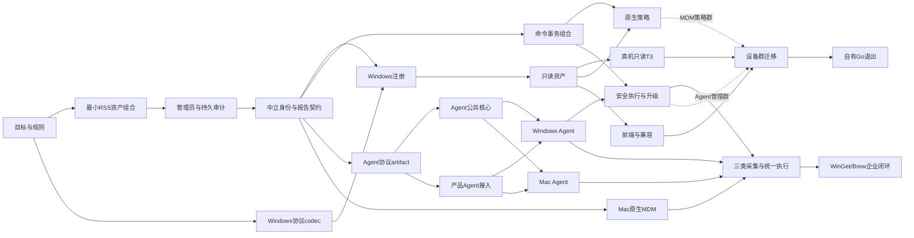

# Rust 重写实施路线

本文件描述交付依赖和验收切片，不充当 issue 状态看板。工程目标见 [项目目标](project-goals.md)，功能承诺以 [PRD](rss-mdm-prd.md) 为准，设计见 [ADR](../architecture/adr/202609072231-001-rust-rss-product-foundation.md)。

## 第一件事：F01 最小独立消费与资产持久化组合

#2346 按维护者决定固定 RSS 最新 Git commit（完整 pin 由 Cargo.toml 持有），使用独立
workspace/lock/toolchain 和本地 CI。此决定取代本项 candidate/registry artifact 前置要求。
实际公共依赖闭包由 metadata/tree 派生，不固定包数量，不新增远端 CI。

单 package/CLI 实现 Observation 持久 receipt → journal → Projection 原子 Inventory/checkpoint。
覆盖最低运行角色、完整/部分报告、重传与冲突、tenant 隔离、回滚、重启、commit unknown、
迁移与 pool 关闭。具体入口、证据和未覆盖项见
[F01 指南](../guides/202609080000-2346-local-inventory.md)。
这是产品基础 T2，不是设备认证或真机 T3；缺真实 PG 必须失败。

## 第一条产品垂直闭环 V1：真实 Windows 只读管理

授权管理员创建一次有界注册授权 → Windows 原生 Discovery/XCEP/WSTEP 注册 → 证书绑定 DevicePrincipal/Registration → 首次 SyncML 会话 → CollectionRun 下发限定 Get → 完整性判定 → Observation 持久 receipt → journal → Projection 原子 Inventory/checkpoint → 授权查询得到字段、来源、采集时间与质量。

选定一台测试 Windows 的 OS/build/edition、注册方式与证书信任，在实现前冻结；字段先限定为设备型号/OS 版本等可支持的非敏感集合。身份记录与事实分开；不拿序列号当唯一认证，不采集无关个人数据。注册成功只表示身份建立，管理员查询看到正确资产才是该闭环的产品结果。

| 验收 | 必须看到的结果 |
| --- | --- |
| 注册与授权 | 无效/过期授权、错误证书和撤销凭据被拒绝；重复注册按定义稳定映射，不串 tenant 或注册世代。 |
| 只读采集 | Get 与完整 session/MsgID/CmdID 关联；未支持字段明确未知，部分响应不清空旧资产。 |
| 持久与恢复 | 同一报告重传幂等；receipt、资产提交分别可查；重启 worker 后无丢失/错误重复，读模型可恢复。 |
| 用户消费 | 有权管理员通过 API 查询同一设备和字段；无权主体不能查询。现有前端接入的子集按契约测试确认，不新增重写 UI。 |
| 最小持久审计 | 注册授权签发/使用、凭据绑定/撤销、认证拒绝与授权资产查询均关联 actor、tenant、request/registration 和结果。关键身份变更与成功审计同事务；审计失败拒绝该变更，不能静默成功。拒绝/查询审计失败不放宽权限，返回可诊断失败并产生运维告警；真实 T3 保存脱敏审计证据。 |
| 真机 T3 | 在独立 issue/PR 保存 OS/服务版本、认证前提、请求/结果与恢复证据；模拟 SyncML 不代替真实终端。 |

V1 的第一完成门是“真机到授权资产 API”；现有前端接入为同波后续兼容门，缺前端源码不阻塞服务端链验证，但未验证 UI 不能宣布用户界面已交付。续期/撤销深度场景继续独立验收，不把一个注册成功扩大为完整证书生命周期完成。

V1 对应 WMD-E01/E02/E04、D01/D02、Q01/Q02/Q05、A01/A03、M01/M02、COL07/08；复用原 T3-01 与 T3-16 的限定子集，不能以此宣称整个 T3-01 或 R0/R1 已完成。

## 依赖顺序与切片

每行是交付切片建议，进入 tracker 后按一个可验收行为拆成 PR；本表不登记执行状态。文件 owner 表示实施责任，同一文件由一个任务修改。

| 切片 | 前置 | 仓库 / 主要文件 owner | 结果与验收 |
| --- | --- | --- | --- |
| F01 独立 Git 消费 + 资产组合 | 本目标 PR | rss-mdm：Cargo/lock/toolchain、消费代码、migrations、T2 | 上述最小真实 PG 证明；不扩建通用组件 |
| F02 最小管理员会话与审计 | F01 | rss-mdm：access/audit 用例与表 | 本地会话、注册许可、凭据动作与查询/拒绝审计；关键变更和成功审计同事务，失败不静默放行 |
| I01 通道中立身份与报告契约 | F01/F02 | rss-mdm：device/registration/principal、report scope | tenant/设备/注册世代/凭据/通道映射及授权；中立 Scope/coverage/报告身份，不依赖 Windows codec |
| F03 XML/SOAP/SyncML codec | 本目标 PR，可与 F01 并行 | rss-mdm：windows-mdm 协议模块 | namespace、结构、输入预算、Fault、MsgRef/CmdRef；固定协议样本 T1 |
| F04 Windows 原生注册 | I01/F03 | rss-mdm：Windows registration、credential、gateway | CSR/公钥绑定、签发未知恢复、证书验证/撤销、重复注册及持久审计；T2 |
| F05 原生 CollectionRun → 查询 | F01/F04 | rss-mdm：Windows collection、inventory、管理 API | 完整性与投影、授权查询及审计；T2 重放/隔离，不另定义通用报告协议 |
| V1-T3 真机只读 | F05 | rss-mdm：限定 tests/t3 与证据 | 上述第一产品闭环，含最小审计；独立 issue/PR |
| F06 前端与 OIDC/证书补齐 | F02/F05；需取得前端基线 | rss-mdm + 前端：API兼容、身份生命周期 | 现有页面可查询、会话/OIDC契约一致；续期/撤销独立用例 |
| F07 命令事务组合 | F01/I01，可与 F04/F05 并行 | rss-mdm：操作/审计表、RSS adapter T2 | 可选 messaging protect + 同 runtime 的 Command/Outbox；区分三套权威坐标，验证 rollback/unknown/取消与 pool owner |
| F08 单一原生策略闭环 | F05/F07；消费已交付的 Group/Scope/Policy 及计划持久化接缝 | rss-mdm：EffectiveDevicePlan、delivery、compliance；复用 N02/N03/N04/N09/N10，不重复实现核心 | 一个支持的防火墙期望经命令下发、实际回读与收敛；离线/重复/撤回 T3 独立 |
| P01 Agent wire artifact 生产 | I01 | rss-mdm：独立协议包、版本化 schema 与协议 fixtures | 先完成 producer PR，产生可取得的精确版本/hash artifact；无 domain/PG 依赖，定义兼容与能力协商 |
| P02 产品 Agent 接入 | P01/F01/I01 | rss-mdm：Agent 注册/报告 API adapter | 独立注册授权、principal绑定、公共报告持久接收及审计；不要求设备先 MDM 注册 |
| A00 Rust Agent 公共核心 | P01 artifact 已取得 | rss-mdm-agent：workspace/lock、core/journal、协议消费 | consumer PR 锁定 P01 的版本/hash，持久报告/结果与回执机制；平台中立测试，无 Windows MDM 依赖 |
| A01 Windows Agent 只读 | A00/P02 | rss-mdm-agent：Windows adapter | Agent-only 注册、采集 snapshot 和 receipt 重传；真实 Windows 验证，不要求 MDM 通道存在 |
| A02 Agent 安全执行与更新 | A01/F07；wire扩展先经P01发布 | rss-mdm-agent：execution、installer/updater；rss-mdm：任务API | 签名脚本与单一 MSI 前后检测/中断恢复；两仓各自 PR，可信升级另一个 T3，不合并两风险 |
| X01 macOS 原生基线 | I01/F01；Apple签名/APNs前提 | rss-mdm：Apple adapter | 手动 MDM Profile/资产，复用中立身份和报告；不依赖 Windows F04/F05 |
| X02 macOS Agent 只读 | A00/P02 | rss-mdm-agent：Mac adapter | Rust Mac Agent-only，不依赖 Windows Agent adapter 或 APNs；与 X01 就绪后验收双通道关联 |
| X03 三类采集与统一执行 | A01/X01/X02；可信脚本执行部分依赖 A02 | 两产品仓：采集绑定、字段、能力计划 | osquery/脚本/MDM 进入同一字段/组；Mac/Windows原生差异可见，跨仓先更新契约再分别实施 |
| X04 WinGet/Brew 与企业管理 | A02/X03；软件闭环消费 N11/N12，原生专属项依赖 X01 | 产品应用与两端执行器；复用后端源/资源/发布能力 | 精确源、审批结果接线、安装检测/撤销；ADE/DDM/安全与更新按 PRD 分包 |
| M01 存量兼容与设备群切换 | 公共前置 V1/F06；MDM 策略群另需 F08，Agent 管理群另需 A02；按所迁群承诺能力就绪 | rss-mdm：migration、cutover、deployment；Agent兼容 | 身份/证书/旧任务对账，实际停 Go worker 后单 owner接管；切换/恢复分别 T3 |
| M02 自有 Go 退出 | M01 所有已承诺群完成 | 两产品仓及实际旧部署 owner | 无运行/恢复依赖旧服务、旧Agent或同步开关；第三方NanoMDM不属于自有Go退出 |

图为主依赖概览，精确前置与特殊依赖以表格为准。F03/F01 可并行；命令组合不挡 V1。P01 producer 先于 A00 consumer，A00 拥有 Agent 公共基础文件；A01 与 X02 仅改各平台 adapter，避免并行争写 workspace/journal。中立身份/报告契约稳定后即可推进 Agent 与 Mac，不依赖 Windows MDM 注册完成。跨仓工作包必须拆为各仓 PR，不能把一个工作包当单个跨仓 PR。

## 独立后端能力 N01–N12

#2378 的后端切片可在端侧执行之前交付，不等待 V1、Windows 注册/采集或父 Epic 整体关闭。
契约与 package 身份唯一归 [ADR](../architecture/adr/202609072231-001-rust-rss-product-foundation.md#独立后端能力契约n01--2379)；
以下目录是未来实现 owner，登记不表示包已创建或验收通过。核心与 PG adapter 均须[独立消费证明](../rules/rust-rss-dependencies.md#产品内部逐-crate-独立消费)。

| PBI | 硬前置 | 目录 owner | 独立验收 |
| --- | --- | --- | --- |
| N01 #2379 | 无 | 当前 ADR、路线、PRD、消费规则 | 冻结名称与契约，不创建空包 |
| N02 #2380 Group | N01 | `crates/group`（纯核心已实现；[指南与验证入口](../guides/202609090000-2380-group-core.md)） | 固定时钟、类型/预算、未知值、历史对照、成员差分 T1；逐包 Git 消费结果绑定 local-ci 受测 SHA，不代表 N09/N12 或 T3 |
| N03 #2381 Scope | N01 | `crates/scope` | 未配置/空限制、来源解释、去重、输入顺序与混租户 T1 |
| N04 #2382 Policy | N01 | `crates/policy` | 版本竞争、稳定计划身份、重复计算、取消与未知事实 T1 |
| N05 #2383 Resource | N01 | `crates/resource` | 不可变版本、平台身份、摘要和引用约束 T1 |
| N06 #2384 WinGet | N01 | `crates/winget-source` | 官方协议 fixtures T1、真实 HTTP T2，不调用 CLI |
| N07 #2385 Brew | N01 | `crates/brew-source` | Formula/Cask 与模板转义 T1、受控本地 Git T2 |
| N08 #2386 发布 | N01 | `crates/software-release` | 审批摘要变化、晋级/撤回、非法转换、未知发布恢复 T1 |
| N09 #2387 Group PG | N02 | `crates/group-postgres`，静态组定义/手工成员与动态规则/成员的专属 migrations/T2 | 静态组 CRUD/批量成员、动态重算与静态成员互不覆盖；状态/事件原子性、并发版本冲突、tenant 隔离、重启/提交未知及借用事务回滚 T2 |
| N10 #2388 Policy PG | N04 | `crates/policy-postgres`，专属 migrations/T2 | 计划/事件原子性、旧版本隔离、回滚/提交未知 T2，不派发 |
| N11 #2389 发布后端组装 | N05/N06/N07/N08 | `crates/resource-postgres`、`crates/software-release-postgres`，应用骨架的软件源组装模块及 T2 | 真实 PG + 存储/兼容源/Git；外部成功而本地失败或未知时按原身份对账 |
| N12 #2390 管理 API | N03/N09/N10/N11、#2347/#2348 | 复用 #2343 实际应用骨架（`crates/app` 以实际路径为准）、设备资产映射、Scope 定义/版本/引用历史的应用 repository/迁移、路由/权限/审计/T2 | 真实 PG + HTTP：静态组管理、资产→组→范围→持久计划、资源→审批→源发布；Scope 重启恢复/并发版本更新/tenant 隔离、引用新增与删除竞争、被引用对象删除拒绝、审计失败整体回滚；无端侧派发 |

N01 后 N02–N08 可并行；N09/N10 各随对应核心就绪推进，N11 随四项核心就绪推进，不等待其他无消费关系的任务。
N12 复用 #2343 身份接入、#2347 对象授权/审计、#2348 设备映射和 F01 资产；#2363 管理员身份组映射不是设备 Group 前置。
与 #2353 协调应用装配文件 owner，但 #2353 整项和 #2354 真机 T3 均不是 N12 硬前置。
功能 DAG 不代表共享文件可并行写：Cargo.toml/Cargo.lock、CI 包身份登记、公共入口和统一迁移/路由/配置由单一集成人串行集成；每个核心只修改所属目录，PG schema/T2 随 adapter 交付，不为抢占目录创建空包。

F08 消费已交付的组/范围/计划机制后另做命令与真机闭环；软件相关 X04 消费 N11/N12，不再重复建设源协议和审批核心。
本批不包含 Agent、端侧安装/用户切换、领取回执、可信升级、MDM 变更派发或 T3；后端 Published 不等于设备已安装，也不完成 PRD R0–R3 的发布退出门。

## 与 PRD 分期的关系

F01/F02/F03/F04/F05 为 R0/R1 提供基础，但 V1 并不完成 R0 的 Windows Agent 真执行要求。F07/F08/A01/A02 补齐 R0 的可信执行与 Windows 能力；X01/X02/X03 和真实双平台接入形成 R1；X04 与相应企业功能形成 R2；MQTT/Kafka/可选 Saga 等按具体价值属于后续切片。V1/V2 等工程切片不能取代 PRD 的 R0–R3 发布退出条件。

## 现在需要落实的输入

- F01：固定 RSS Git revision、完整依赖闭包、工具链和真实 PG；实际结果绑定产品 PR 的本地 CI HEAD，不伪称 artifact 发布或远端 CI。
- F04/V1：测试 Windows 与注册管理员、DNS/TLS/签发方式、受支持字段；缺真机只允许完成 T1/T2，不勾选 T3。
- F06/M01：现有前端 revision、实际 API/会话契约、存量设备/凭据/证书/控制URL；仅历史 ZIP 不能证明生产状态；rss-web 不是旧 WinMDM 前端。
- X01：Apple 组织/证书与测试 Mac；不阻塞无此依赖的 Windows 或 Mac Agent-only 工作。

每项开始前确定输入与支持范围；没有人员预算不承诺工期。缺陷与实施进度进入 tracker，不在仓内新增 backlog 状态副本。
